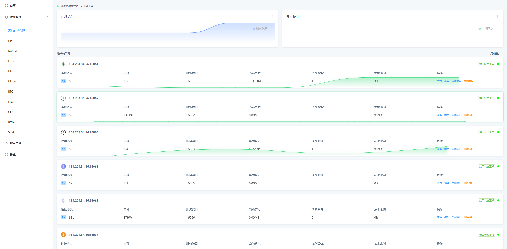
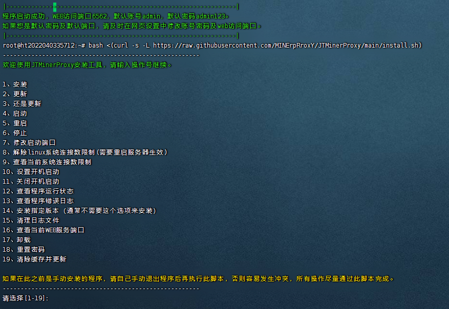

# 支持BTC-LTC-CFX-ETC-KASPA-ALEO-DNX-RVN-ERGO-NEOX-CKB-HNS-MEOW-ETHW-ETHF-BCH-RXD-SERO-XMR-BEAM-ALPH-DCR-FLUX-NEXA-LBC-CTXC长达20多种币种抽水。也可以自己使用纯转发，也可以用来抽别人的，一个软件你想怎么用都行。

# JTMinerProxy - 
最稳定的矿池代理中转矿池程序，JTMinerProxy/矿池代理，支持TCP和SSL协议，支持自定义抽水，高性能高并发，支持web界面管理，包含自启动和进程守护，重启后可以自动运行，会放开防火墙和连接数限制，一键搞定。

# JTMinerProxy - 界面展示，清晰整洁。

<p align="center">
    
  </p>

# 矿工交流 QQ群： 308929177

# Liunx-一键安装脚本
好处：适合又想要Linux稳定性的，又不懂Linux的小白的学习者<br />
功能：包含自启动和进程守护，重启后可以自动运行，会放开防火墙和连接数限制，一键搞定<br />
要求：Ubuntu 16+ / Debian 8+ / CentOS 7+ 系统<br />
使用 root 用户输入下面命令安装或卸载<br />


<h2>免责声明</h2>
<p>本软件仅在法律允许的范围内使用。如果您使用本软件，即表示您默认接受本许可。如果您在限制区域使用它，您将对法律问题负责.</p>

### 输入命令

```bash

bash <(curl -s -L https://raw.githubusercontent.com/MINErpRroxY/JTMinerProxy/main/install.sh)
```

### 十分快捷，简单的操作适合新手小白一键式操作，长达19种操作选项.



### 使用方法

```bash
一.输入完一键命令代码后，选择1安装
二.安装完成后，下方提示有WEB访问端口，跟你的默认账号密码
三.请打开浏览器，输入你的服务器IP地址加软件提示的WEB访问端口号，然后等待进入。例如164.54.12.166:端口号
四.输入你的默认账号密码进去以后，可以选择设置-账号设置，修改你的账号跟密码
五.点击矿池管理-添加矿池代理

请注意，如果使用纯转发模式，请选择币种选项最下面的那个PROXY

六.详细解释
1.端口号-意思是你的挖矿软件的所需要填写的端口号
2.币种-你需要挖矿的币种
3.端口协议-你挖矿软件是否支持tcp或ssl，需要哪个开哪个，默认tcp
4.目标矿池-你要挖矿的挖矿地址
5.矿池SSL-你填写的挖矿地址是ssl的就开打，不是就不用开
6.抽水管理，同理，抽水比例1就是1%
  抽水钱包地址还有工人名称
  抽水矿池地址填写
  抽水矿池是否为ssl，反之不开启。
  正常是无损模式，如遇到拒绝率飞起，就改为兼容模式
  然后创建
 
 ```
  
  
## 香港本地公司服务商推荐，低延迟，安全，无需备案。
```
注册抢购价366一年:链接:https://my.htstack.com/aff.php?aff=7162
先点击右上角快速注册，然后再点击左上角的最新活动，选择第二个云服务器
选择香港服务器366一年超划算。如果你的矿机算力足够大，可以选择第二个款配置。
```

## Liunx常用命令
```bash
常用命令
root权限开启
输入su root 
再输入密码

防火墙相关命令
1.防火墙打开
sudo ufw enable
2.防火墙重启
sudo ufw reload
3.打开想要的端口（以9000为例）
ufw allow 9000
4.查看本机端口使用情况
ufw status
5.关闭防火墙
sudo ufw disable

wget安装命令             yum安装命令               nohup安装命令
apt install wget        apt install  yum          apt install nohup

```

## 提示bash: git: command not found的先安装git
### ubuntu下
```bash
apt update
apt install git
```
### centos下
```bash
yum update
yum install git
```
 
# 重点需要观看的挖矿说明
```
WEB访问长期卡在LOADING界面，请等待
安装或更新后，首次加载网页界面可能需要较长时间。如果长时间没有访问，请更换chrome浏览器，或清除缓存，不行的尝试用手机打开。

默认账户密码
默认账号：admin
默认密码：admin123

算力不足的常见原因
如果测试后24小时平均值与设置的差距太大，比如设置为1%，但平均值要小很多。出现这种情况的原因有很多，需要一步步检查。
平时检查一下是不是本地被打了，或者设备有没有问题。比如中转中的一些设备效率低下，效率很低。在这种情况下，通常是卡有问题。发现后通常更容易排除故障。在JT中找到失效率高的设备，点击查看日志中是否有很多POW相关的关键字，如果有则说明该设备的硬件有问题，导致失效和算力低下。
更常见的原因是本地攻击，这种情况很容易遇到，但很难排除。可以在JT中创建纯转发端口，使用纯转发端口测试设备24小时平均值。如果端口24小时运行不够，那么大概率是本地攻击，本地重装干净系统即可解决问题。

填写挖矿地址的时候，不需要填写stratum+ssl://或者stratum+tcp://
旁边有开关只需要输入正常的挖矿地址即可

如遇拒绝率飞起，请更改为兼容模式，马上解决问题。

如还有不懂的，在群里有专门的的解答。QQ群： 308929177
```
# 免责说明
<p id="flsm">
开发者仅在技术和爱好的驱动下维护本软件，本软件仅验证技术流程。

使用前请遵守当地法律，禁止在不允许的地区使用。

使用本软件引起的法律问题与软件作者无关。
</p>

